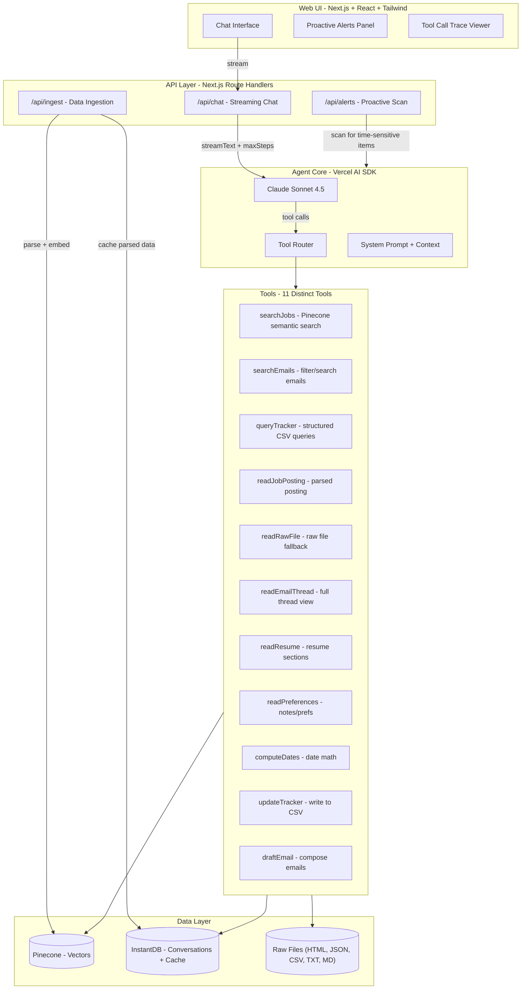

# Job Hunt Agent - Build Plan

## Overview

Build a full-stack AI job search assistant using Next.js, Vercel AI SDK (Anthropic Claude Sonnet 4.5), Pinecone for semantic search, and InstantDB for real-time data/conversation persistence. The agent parses messy multi-format data, exposes 8+ tools, streams responses, shows reasoning traces, and surfaces proactive alerts.

## Tech Stack

- **Runtime**: Next.js 15 (App Router, TypeScript)
- **UI**: React 19 + Tailwind CSS 4
- **LLM**: Anthropic Claude Sonnet 4.5 via `@ai-sdk/anthropic`
- **Agent Loop**: Vercel AI SDK (`streamText` with `maxSteps` for multi-step tool calling)
- **Vector Search**: Pinecone (semantic search over job postings + emails)
- **Embeddings**: OpenAI `text-embedding-3-small` (1536 dimensions, used for Pinecone vectors)
- **Real-time DB**: InstantDB (conversation history persistence, cached parsed data)
- **HTML Parsing**: `cheerio` (lightweight, no browser needed)
- **CSV Parsing**: `papaparse`

---

## Architecture



### Agent Loop (Vercel AI SDK `maxSteps`)

The Vercel AI SDK provides a built-in agentic loop via `streamText` with `maxSteps`. Each "step" is:

1. **Observe**: Model receives messages + tool results from previous steps
2. **Think**: Model decides which tool to call (or to respond directly)
3. **Act**: SDK executes the tool, feeds result back as next step

This repeats up to `maxSteps` (we'll set 10), allowing multi-step reasoning like: search jobs -> read a specific posting -> read resume -> synthesize answer.

```typescript
// Core pattern in /api/chat/route.ts
const result = streamText({
  model: anthropic('claude-sonnet-4-5-20250514'),
  system: buildSystemPrompt(proactiveContext),
  messages: conversationHistory,
  tools: allTools,
  maxSteps: 10,
  onStepFinish: ({ toolCalls, toolResults }) => {
    // Log reasoning trace for UI display
  },
});
return result.toDataStreamResponse();
```

---

## Project Structure

```
jobSeekerAgent/
├── data/                              # Copied dataset
│   ├── job_postings/                  # 40 HTML files
│   ├── emails/inbox.json
│   ├── resume/alex_chen_resume.txt
│   ├── tracker/job_tracker.csv
│   └── notes/job_search_notes.md
├── src/
│   ├── app/
│   │   ├── layout.tsx                 # Root layout + InstantDB provider
│   │   ├── page.tsx                   # Main chat page
│   │   ├── globals.css                # Tailwind imports
│   │   └── api/
│   │       ├── chat/route.ts          # POST - streaming chat endpoint
│   │       ├── ingest/route.ts        # POST - data ingestion pipeline
│   │       └── alerts/route.ts        # GET  - proactive alerts scan
│   ├── lib/
│   │   ├── agent/
│   │   │   ├── tools.ts               # All tool definitions (Zod schemas)
│   │   │   ├── system-prompt.ts       # System prompt builder
│   │   │   └── proactive-alerts.ts    # Startup scan logic
│   │   ├── parsers/
│   │   │   ├── html-parser.ts         # Cheerio-based HTML->structured data
│   │   │   ├── email-parser.ts        # Email JSON normalization
│   │   │   ├── csv-parser.ts          # CSV parsing + status normalization
│   │   │   ├── resume-parser.ts       # Resume section extraction
│   │   │   └── notes-parser.ts        # Markdown section parsing
│   │   ├── db/
│   │   │   ├── pinecone.ts            # Pinecone client + upsert/query
│   │   │   ├── instantdb.ts           # InstantDB schema + client
│   │   │   └── embeddings.ts          # Embedding generation
│   │   └── utils/
│   │       ├── date-utils.ts          # Date parsing, diffing, formatting
│   │       └── text-utils.ts          # Text cleaning, truncation
│   ├── components/
│   │   ├── ChatInterface.tsx          # Main chat container
│   │   ├── MessageBubble.tsx          # User/assistant message rendering
│   │   ├── ToolCallDisplay.tsx        # Expandable tool call traces
│   │   ├── StreamingIndicator.tsx     # Loading states + spinners
│   │   ├── ProactiveAlerts.tsx        # Alert cards at top of chat
│   │   └── MarkdownRenderer.tsx       # Rich markdown in responses
│   └── types/
│       └── index.ts                   # Shared TypeScript types
├── scripts/
│   └── ingest.ts                      # CLI script: ts-node scripts/ingest.ts
├── .env.local                         # API keys (Anthropic, Pinecone, InstantDB)
├── package.json
├── tsconfig.json
├── tailwind.config.ts
├── next.config.ts
└── README.md
```

---

## Phase 1: Project Setup & Data Parsers

### 1a. Initialize Next.js project

- `npx create-next-app@latest` with TypeScript, Tailwind, App Router
- Install deps: `@ai-sdk/anthropic`, `@ai-sdk/openai`, `ai`, `@pinecone-database/pinecone`, `@instantdb/react`, `cheerio`, `papaparse`, `zod`, `react-markdown`, `date-fns`
- Copy dataset into `data/` directory
- Configure `.env.local` with API keys

### 1b. Build data parsers

Each parser takes raw file content and returns a clean, typed structure.

**HTML Parser** (`html-parser.ts`) — **Text-First, Structure-Second**:

- Use `cheerio` to load each HTML file
- **Layer 1 (always succeeds)**: Strip scripts, styles, nav, cookie banners, footers. Extract clean readable text from the body. This `rawText` is always stored and always indexed — it is the fallback that guarantees the agent is never blind to a file.
- **Layer 2 (best-effort structured extraction)**: Attempt to extract structured fields: job title, company, location, salary range, requirements, responsibilities, description. Strategy: try `__NEXT_DATA__` JSON, then `data-automation-id` / semantic selectors, then heading/section heuristics.
- Return `JobPosting` typed object with: structured fields (`null` when not extractable — never guess), a `rawText` field (always populated), a `parseConfidence: "full" | "partial" | "text-only"` indicator, and the source `filename`.
- **Key principle**: A file that fails structured extraction is NOT a failure. It still gets embedded and indexed via `rawText`. The agent can always retrieve and read it.

**Email Parser** (`email-parser.ts`):

- Parse `inbox.json`, group by `thread_id`
- Normalize fields (date parsing, sender extraction)
- Classify email type heuristically: confirmation, recruiter_outreach, interview_scheduling, rejection, offer, spam, newsletter
- Return `Email[]` and `EmailThread[]` typed arrays

**CSV Parser** (`csv-parser.ts`) — **Preserve Ambiguity**:

- Use `papaparse` to parse `job_tracker.csv`
- Each `TrackerEntry` stores **both** `statusRaw` (original string, verbatim) and `statusNormalized` (best-effort canonical mapping, or `"unknown"` if unrecognizable)
- Normalization maps common variants ("applied", "Applied", "sent app" -> `"applied"`), but values like `"???"` or free-text are preserved as-is in `statusRaw` and mapped to `statusNormalized: "unknown"`
- Parse dates into consistent format where possible; store `dateRaw` alongside `dateParsed` (null if unparseable)
- Return `TrackerEntry[]` — the agent sees the original messy data and can report uncertainty honestly

**Resume Parser** (`resume-parser.ts`):

- Split by section headers (SUMMARY, EXPERIENCE, EDUCATION, SKILLS, PROJECTS)
- Return structured `Resume` object with typed sections

**Notes Parser** (`notes-parser.ts`):

- Parse markdown headings into sections
- Extract key structured data: preferred locations, salary expectations, deal breakers, ranked companies, timeline items
- Return `Preferences` object

---

## Phase 2: Data Ingestion & Vector Index

### 2a. Pinecone setup

- Create Pinecone index with 1536 dimensions (matches OpenAI `text-embedding-3-small`)
- Namespace strategy: `job-postings`, `emails`, `resume` (separate namespaces for targeted search)

### 2b. Ingestion pipeline (`scripts/ingest.ts` + `/api/ingest`)

1. Parse all 40 HTML files -> `JobPosting[]`
2. Parse emails -> `Email[]` with threads
3. Parse CSV -> `TrackerEntry[]`
4. Parse resume + notes
5. Generate embeddings for each job posting — use structured fields where available, fall back to `rawText` for partial/text-only parses (every posting gets indexed regardless of parse quality)
6. Generate embeddings for each email (subject + body)
7. Generate embeddings for resume sections
8. Upsert all vectors to Pinecone with metadata (company, date, type, etc.)
9. Cache parsed structured data in InstantDB for fast structured queries

### 2c. InstantDB schema

- `conversations`: id, messages[], createdAt, updatedAt
- `parsedJobs`: id, company, title, location, salary, requirements, rawFile, parsedAt
- `parsedEmails`: id, threadId, from, subject, date, type, body
- `trackerEntries`: id, company, role, status, dateApplied, salary, location, notes
- `resumeData`: id, sections
- `preferences`: id, sections, dealBreakers, excitedCompanies

---

## Phase 3: Tool Definitions

Define 8+ tools using Zod schemas for the Vercel AI SDK.

### Tool 1: `searchJobs`

- **Input**: `{ query: string, filters?: { location?, salaryMin?, remote? } }`
- **Action**: Embed query -> Pinecone similarity search in `job-postings` namespace -> return top-K matches with metadata
- **Purpose**: Semantic search like "distributed systems roles in SF"

### Tool 2: `searchEmails`

- **Input**: `{ query?: string, from?: string, company?: string, dateRange?: { start, end }, type?: EmailType }`
- **Action**: If query provided, use Pinecone semantic search; otherwise filter cached emails in InstantDB
- **Purpose**: Find emails by content, sender, company, or type

### Tool 3: `queryTracker`

- **Input**: `{ company?: string, status?: string, dateRange?: { start, end }, all?: boolean }`
- **Action**: Query InstantDB cached tracker entries with filters
- **Purpose**: Check application statuses, find stale applications

### Tool 4: `readJobPosting`

- **Input**: `{ company: string }` or `{ filename: string }`
- **Action**: Find and return full parsed job posting details, including `parseConfidence` so the agent knows if data is complete or partial
- **Purpose**: Deep-read a specific posting for interview prep, comparison, etc.
- **Agent guidance**: If `parseConfidence` is `"partial"` or `"text-only"` and a specific field is null, the agent should follow up with `readRawFile` to inspect the source directly

### Tool 5: `readEmailThread`

- **Input**: `{ threadId: string }` or `{ company: string, subject?: string }`
- **Action**: Return all emails in a thread, chronologically ordered
- **Purpose**: Follow conversation history with a recruiter

### Tool 6: `readResume`

- **Input**: `{ section?: "summary" | "experience" | "skills" | "education" | "projects" }`
- **Action**: Return full resume or specific section
- **Purpose**: Find relevant experience for interview prep

### Tool 7: `readPreferences`

- **Input**: `{ section?: "salary" | "location" | "dealBreakers" | "excitedCompanies" | "timeline" | "negotiation" | "interviewQuestions" }`
- **Action**: Return preferences/notes or specific section
- **Purpose**: Cross-reference preferences with job postings

### Tool 8: `computeDates`

- **Input**: `{ operation: "diff" | "add" | "businessDays", date1: string, date2?: string, days?: number }`
- **Action**: Compute date differences, add days, count business days
- **Purpose**: "How long since I applied?" "When does the offer expire?"

### Tool 9: `readRawFile` (feedback loop)

- **Input**: `{ filename: string, maxLines?: number }`
- **Action**: Read and return the raw file content (HTML, JSON, CSV, TXT, MD) from the data directory, optionally truncated. For HTML, strip `<script>` and `<style>` tags but return the rest as-is.
- **Purpose**: Escape hatch when structured parsing fails. If the agent sees `salary: null` from `readJobPosting`, it can call `readRawFile` to inspect the original HTML and extract the information itself via the LLM. This closes the feedback loop — the agent is never stuck with incomplete parsed data.

### Tool 10: `updateTracker` (bonus)

- **Input**: `{ company: string, updates: Partial<TrackerEntry> }`
- **Action**: Update CSV file and InstantDB cache
- **Purpose**: Keep tracker up to date

### Tool 11: `draftEmail` (bonus)

- **Input**: `{ to: string, subject: string, context: string, tone: "professional" | "casual" }`
- **Action**: Return a drafted email body (LLM-generated via inner call or prompt)
- **Purpose**: Draft follow-ups, negotiation emails

---

## Phase 4: Chat API & System Prompt

### System Prompt Design

The system prompt will:

- Describe the agent's role as a job search assistant for Alex Chen
- List available tools with usage guidance
- Include instructions for multi-step reasoning
- Include "know what you don't know" instructions (admit uncertainty, don't hallucinate)
- Include today's date for date-relative calculations
- Optionally inject proactive context (alerts summary) into first message

### Chat Route (`/api/chat/route.ts`)

- Accept POST with `{ messages: Message[] }`
- Load conversation from InstantDB if session exists
- Build system prompt with proactive context on first message
- Call `streamText` with all tools and `maxSteps: 10`
- Stream response back via `toDataStreamResponse()`
- Save conversation turn to InstantDB on completion

---

## Phase 5: Web UI

### Main Chat Interface (`page.tsx` + components)

- Full-screen chat layout, modern design (think ChatGPT/Claude UI)
- **Input area**: Text input with send button, auto-resize textarea
- **Message list**: Alternating user/assistant bubbles with markdown rendering
- **Tool call traces**: Collapsible accordion showing which tools were called, inputs, and outputs (visible reasoning)
- **Streaming**: Real-time token streaming with typing indicator
- **Proactive alerts**: Banner/cards at top of chat on first load showing time-sensitive items

### UI Components

- `ChatInterface`: Main container, manages `useChat` hook from Vercel AI SDK
- `MessageBubble`: Renders user or assistant message with `react-markdown`
- `ToolCallDisplay`: Expandable panel showing tool name, parameters, result summary
- `ProactiveAlerts`: Cards for deadline warnings, stale applications, upcoming interviews
- `StreamingIndicator`: Animated dots/spinner during agent processing

### Styling

- Tailwind CSS with a clean, professional color scheme
- Dark mode support via Tailwind `dark:` classes
- Responsive layout (works on mobile)
- Smooth scroll-to-bottom on new messages

---

## Phase 6: Proactive Alerts (Bonus - Gold Tier)

### On-startup scan (`proactive-alerts.ts`)

When the chat loads, automatically scan data for:

- **Offer deadlines approaching**: Check tracker + emails for offer expiry dates (Stripe: Feb 21)
- **Stale applications**: Tracker entries with no email activity in 2+ weeks
- **Upcoming interviews**: Email threads with scheduled dates in the near future (Notion: Feb 20)
- **Action items**: Unresponded recruiter emails, pending follow-ups

Display these as alert cards before the user even asks.

---

## Phase 7: Polish & README

### Error Handling

- Tool-level try/catch with graceful error messages
- HTML parsing failures: return partial data + note what couldn't be extracted
- Pinecone/InstantDB connection errors: fall back to direct file reads
- Malformed CSV rows: skip with warning, don't crash

### Conversation Memory

- InstantDB stores full conversation history
- Conversations persist across page refreshes/sessions
- Agent can reference earlier messages in the same session

### README Contents

- Architecture overview with diagram
- Setup instructions (env vars, Pinecone index creation, data ingestion)
- Design decisions and tradeoffs
- What I'd improve with more time
- Screen recording instructions

---

## Bonus Features Summary (Prioritized)

- **Must**: Agentic loop (Vercel AI SDK maxSteps) - Phase 4
- **Must**: 8+ tools with Zod schemas - Phase 3
- **Must**: Multi-source reasoning - Phase 3-4
- **Must**: Error handling - Phase 7
- **Must**: Web UI - Phase 5
- **Should**: Visible reasoning (tool traces) - Phase 5
- **Should**: Context management (Pinecone, not dump all) - Phase 2-3
- **Should**: Conversation memory (InstantDB) - Phase 4-6
- **Bronze**: Semantic search (Pinecone) - Phase 2
- **Bronze**: Streaming responses - Phase 4-5
- **Bronze**: Update tracker CSV - Phase 3 (Tool 9)
- **Silver**: Rich Web UI - Phase 5
- **Silver**: Conversation persistence - Phase 4
- **Gold**: Proactive alerts - Phase 6
- **Gold**: Plugin/tool extensibility - Built into tool architecture
